# MindLog

Diário emocional digital (check-in de humor, diário pessoal, chat com IA mockada e
comunidade). **Projeto acadêmico** — UNIFRAN, disciplina de UX/UI, Prof. Renato Rocha.

## Foco deste repositório

A disciplina é de **UX/UI**, mas este repositório foi publicado no GitHub para **praticar
e demonstrar três coisas de back-end**, num contexto realista de saúde mental:

1. **Modelagem e operação de banco de dados** (Prisma + SQLite);
2. **Hash de senha** (Argon2id);
3. **Criptografia em repouso** de dados sensíveis (AES-256-GCM).

É um **primeiro passo**, assumidamente simples, com a intenção de aprofundar depois. Isso
está alinhado ao `briefing.md`, que define o foco do projeto como **modelagem e operação
de banco em contexto realista**, incluindo considerações de LGPD para dados de saúde. A
interface (a parte de UX/UI) existe, mas **não é o assunto deste README** — há uma menção
curta no final.

## Modelagem do banco

Entidades principais e relações (detalhe completo em [`docs/schema.md`](./docs/schema.md)):

- **Usuario** — pessoa cadastrada; dona de todos os dados. `1:N` com quase tudo; `N:1` com
  **Plano**.
- **Sessao** — sessão de login (cookie HTTP-only). `N:1` com Usuario.
- **Plano** — Semente / Equilíbrio / Florescer (tabela de referência, via seed).
- **RegistroHumor** — check-in de humor (escala 1–4) + nota opcional. `N:1` com Usuario.
- **EntradaDiario** — entrada de diário (texto livre). `N:1` com Usuario; `1:1` opcional
  com RegistroHumor.
- **SessaoChat / MensagemChat** — conversa com a IA mockada e suas mensagens
  (`1:N`); `autor` é enum `USUARIO | IA`.
- **Post / Curtida** — comunidade; **Curtida** é a junção `N:N` entre Usuario e Post
  (PK composta `@@id([usuarioId, postId])`, que impede curtida duplicada).
- **AuditLog** — trilha de auditoria (append-only) de alterações em dados sensíveis (LGPD).

Decisões de modelagem (CUID em vez de autoincrement, soft delete, fuso horário nas
agregações, etc.) estão em [`docs/decisoes.md`](./docs/decisoes.md).

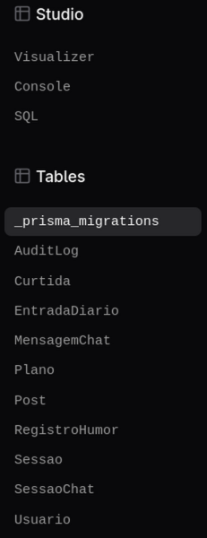

## Criptografia em repouso

Campos de **texto sensível** são cifrados pela aplicação **antes** de gravar e decifrados
só ao exibir — no banco ficam ilegíveis:

- `EntradaDiario.conteudo`, `RegistroHumor.nota`, `MensagemChat.conteudo`.

Detalhes:

- **Algoritmo:** AES-256-GCM (confidencialidade **e** integridade — a leitura detecta
  adulteração). Implementado em `src/lib/crypto.ts`.
- **Chave:** variável de ambiente `ENCRYPTION_KEY` (32 bytes em base64), **nunca
  commitada**.
- **Trade-off consciente (ADR 0008):** o **humor numérico** (`RegistroHumor.humor`, 1–4)
  fica **em claro** de propósito, para permitir **agregação via SQL** (`AVG`, `COUNT`) nos
  insights; só a **nota textual** associada é cifrada. Justificativa em
  [`docs/lgpd.md`](./docs/lgpd.md).

No print abaixo, o conteúdo do diário aparece embaralhado (cifrado) no banco:

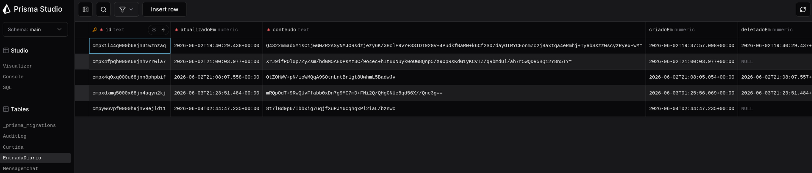

## Hash de senha

Senhas **nunca** são guardadas em texto: armazenamos só o hash.

- **Algoritmo:** Argon2id, via `@node-rs/argon2` (binário Rust/N-API, sem build node-gyp).
- **Parâmetros (mínimos OWASP):** memória **19456 KiB** (19 MiB), **2** iterações,
  paralelismo **1**. Os parâmetros ficam embutidos na própria string do hash, então a
  verificação os lê automaticamente (ADR 0013). Implementado em `src/lib/auth.ts`.

No print, a coluna `senhaHash` mostra o hash no formato `$argon2id$...`:

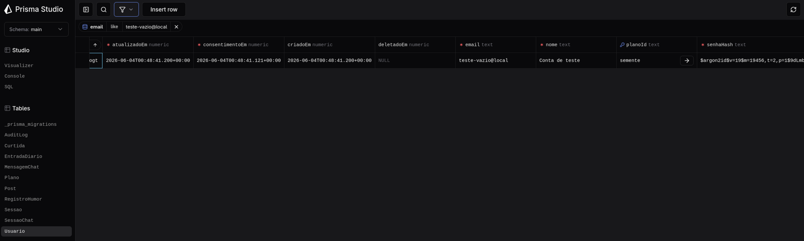

## Stack

- **Next.js 16** (App Router) + **React 19** + **TypeScript**
- **Prisma 7** + **SQLite** (com `@prisma/adapter-better-sqlite3`)
- **Argon2id** (`@node-rs/argon2`) para hash de senha
- **AES-256-GCM** (Node `crypto`) para criptografia em repouso
- Sessão por **cookie HTTP-only** com estado no banco
- **Tailwind CSS 4** na interface

## Como rodar localmente

Pré-requisitos: **Node.js ≥ 20.9** (desenvolvido em Node 26) e npm.

```bash
# 1. Instalar dependências
npm install

# 2. Criar o .env a partir do exemplo
cp .env.example .env

# 3. Gerar uma chave de criptografia (32 bytes) e colá-la em ENCRYPTION_KEY no .env
openssl rand -base64 32

# 4. Criar o banco e aplicar as migrations
npx prisma migrate dev

# 5. Gerar o Prisma Client e popular os planos (caso o passo 4 não tenha populado)
npx prisma generate
npx prisma db seed

# 6. Rodar em desenvolvimento
npm run dev
```

Acesse <http://localhost:3000> e crie uma conta em `/cadastro`. Para inspecionar o banco
(e ver os campos cifrados/o hash de senha): `npx prisma studio`.

## Variáveis de ambiente

Definidas no `.env` (ignorado pelo git). Veja `.env.example`.

| Variável         | Descrição                                                                 |
| ---------------- | ------------------------------------------------------------------------- |
| `DATABASE_URL`   | Caminho do SQLite. Padrão: `file:./prisma/dev.db`.                        |
| `ENCRYPTION_KEY` | Chave AES-256 (32 bytes em base64) para os campos sensíveis. Obrigatória. |

## Sobre a interface (UX/UI)

O projeto também tem uma **interface completa** — a parte de UX/UI da disciplina — com
dashboard, check-in de humor, diário, insights, chat com a IA mockada, comunidade,
exercícios, suporte e perfil, aplicando princípios de UX (Leis de Hick e Fitts, Gestalt,
hierarquia visual). Ela é documentada à parte no [`briefing.md`](./briefing.md) (produto,
persona e telas) e nas decisões de projeto em [`docs/decisoes.md`](./docs/decisoes.md).

### Telas

**Landing page** — apresentação do produto, recursos, "como funciona", privacidade dos
dados e perguntas frequentes.

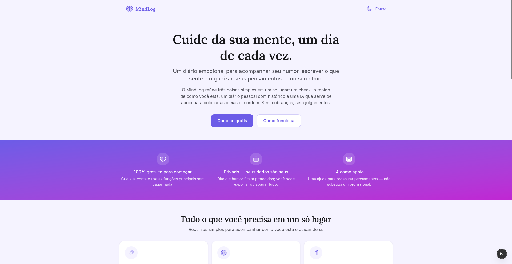
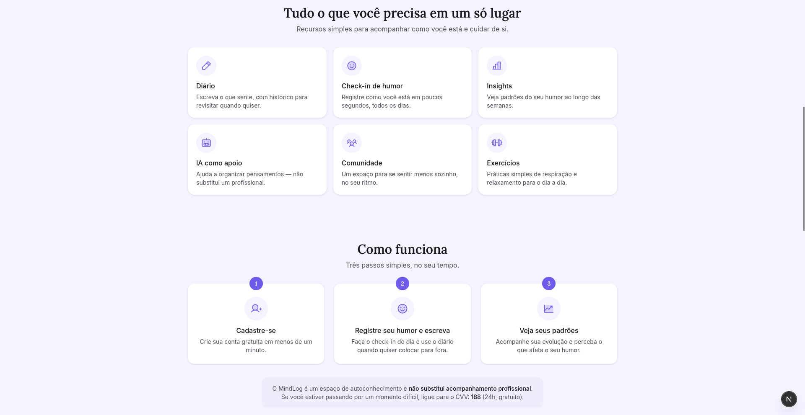
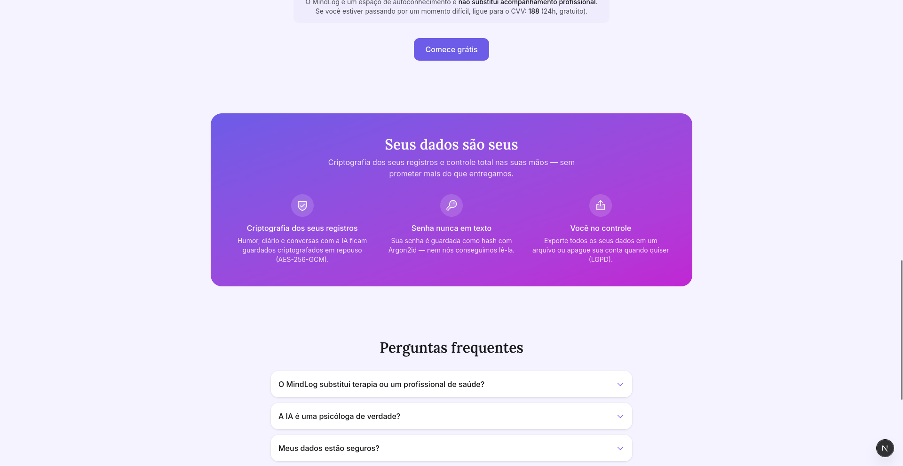
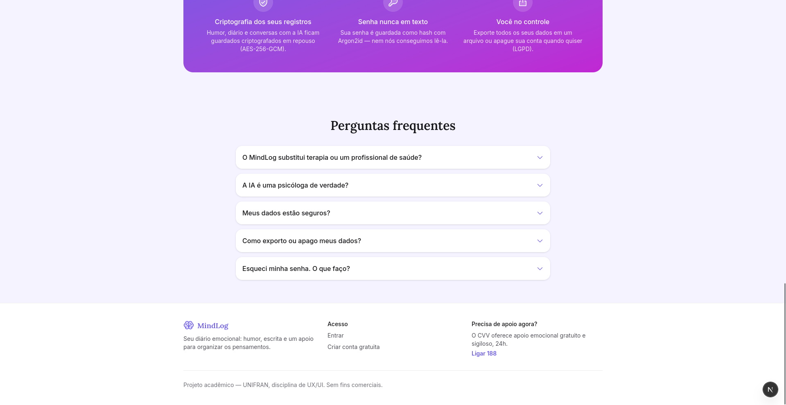

**Cadastro e login** — autenticação real (hash Argon2id + sessão por cookie), com
consentimento explícito no cadastro (LGPD).

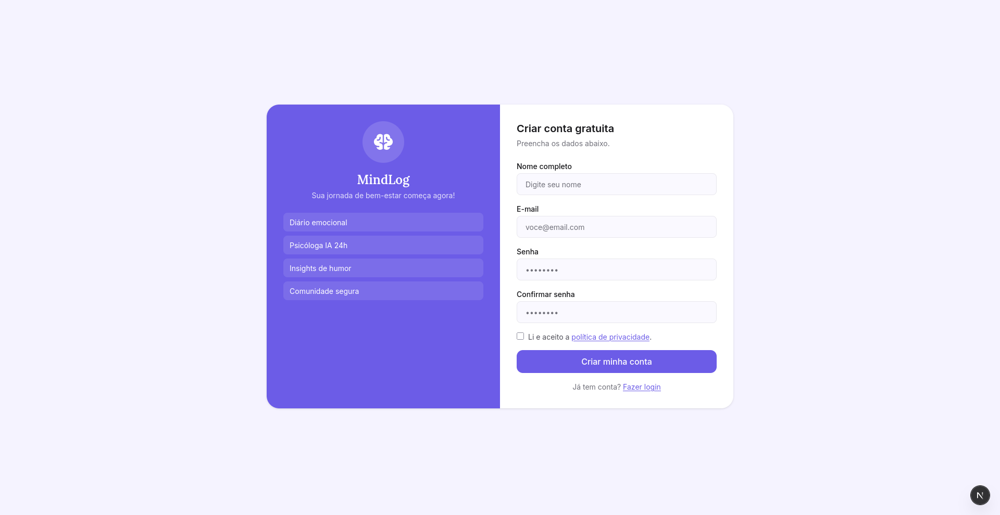
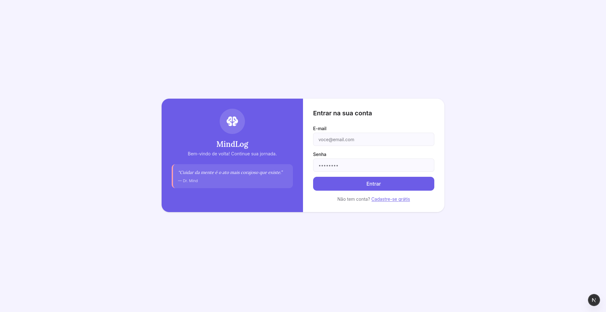

**Início** — painel com saudação, atalhos rápidos (check-in, diário, IA, insights) e
incentivo à sequência diária.

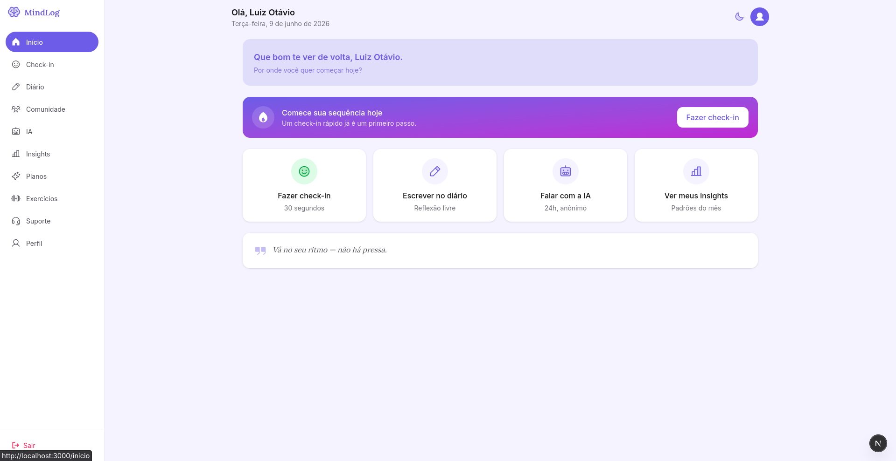

**Check-in de humor** — registro em escala 1–4 com nota opcional.

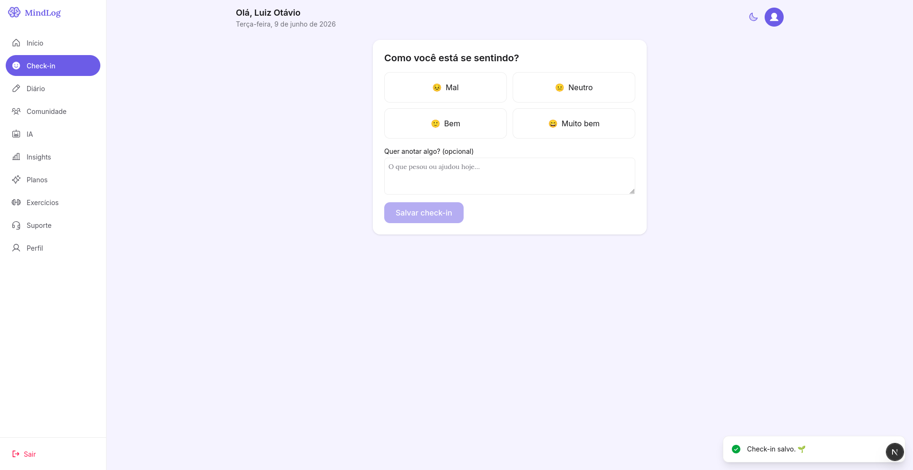

**Diário** — nova entrada com sugestão de tema e tags; histórico com busca por texto e
período.

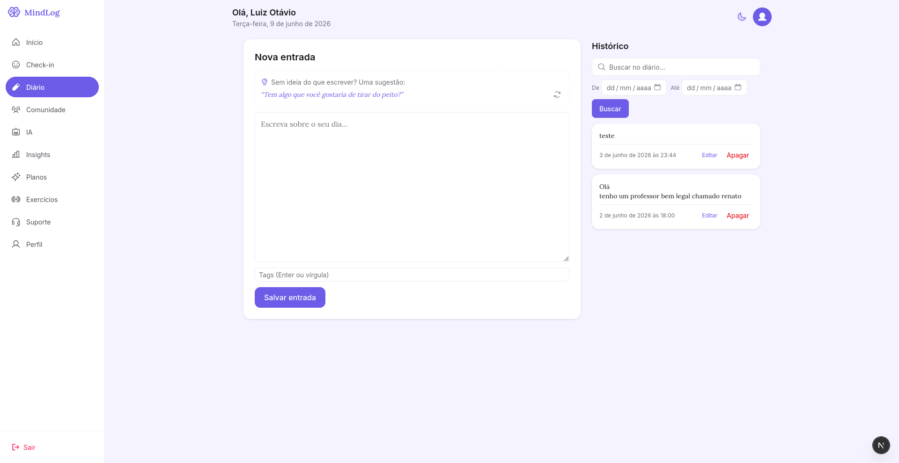

**Insights** — agregações do humor: média, distribuição e padrões por dia da semana.

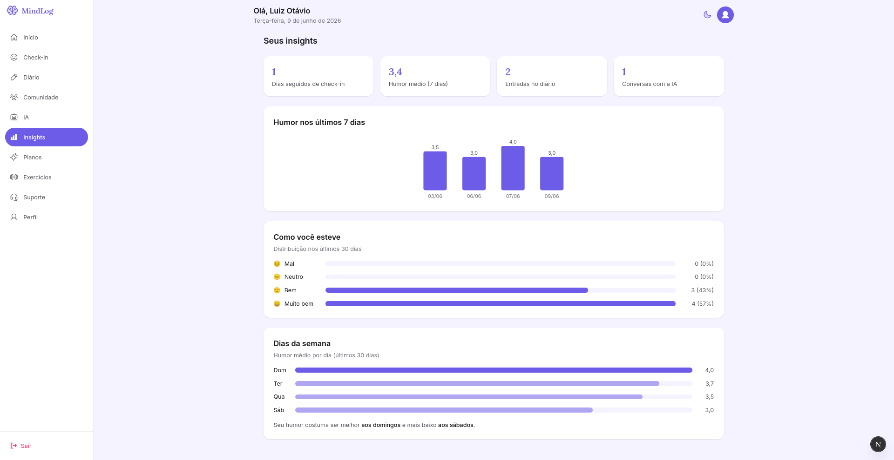

**IA mockada** — chat de apoio com respostas pré-escritas/por palavra-chave, com aviso de
que não substitui um profissional.

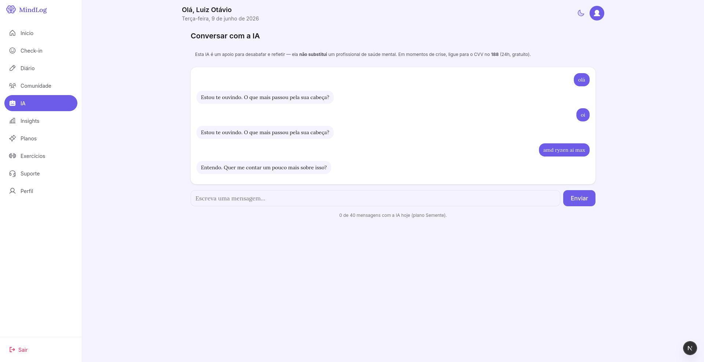

**Comunidade** — publicar posts e curtir (junção `N:N` Usuario × Post).

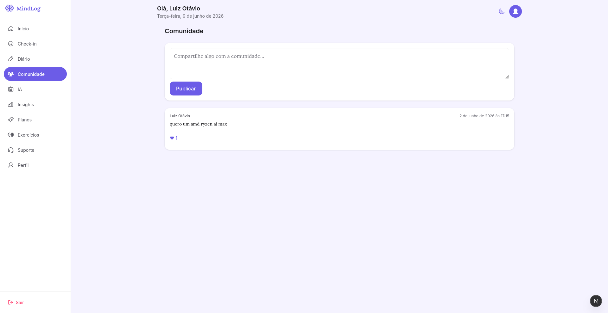

**Exercícios** — práticas curtas de respiração e relaxamento.

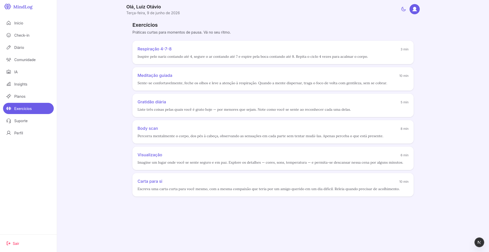

**Planos** — Semente / Equilíbrio / Florescer (troca imediata e sem cobrança real).

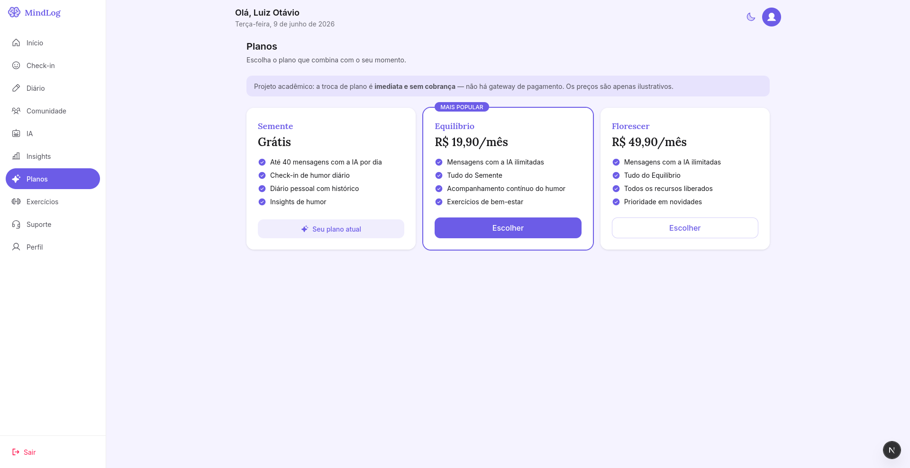

**Suporte** — canais de ajuda (CVV) e perguntas frequentes.

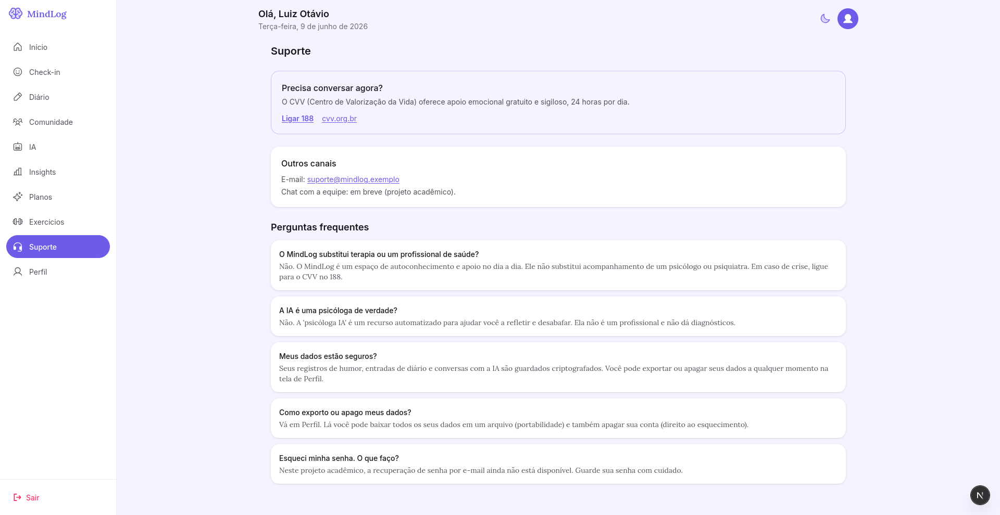

**Perfil** — dados da conta, exportação de dados (portabilidade) e exclusão de conta via
soft delete + anonimização (direito ao esquecimento, LGPD).

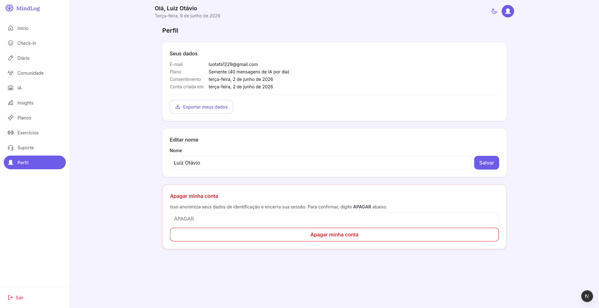

## Documentação

- [`briefing.md`](./briefing.md) — visão de produto, persona e telas (fonte de verdade).
- [`docs/schema.md`](./docs/schema.md) — modelagem do banco em detalhe.
- [`docs/lgpd.md`](./docs/lgpd.md) — tratamento de dados, criptografia e LGPD.
- [`docs/decisoes.md`](./docs/decisoes.md) — registro de decisões (ADRs).

## Licença

Ver [`LICENSE`](./LICENSE).
